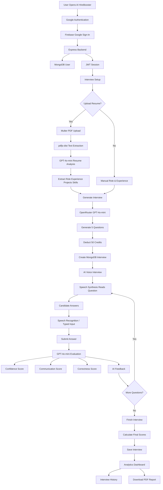

# 🤖 AI HireBooster

### AI-Powered Mock Interview Platform with Resume Analysis, Voice Interviews, Real-Time Evaluation & Performance Analytics

**AI HireBooster** is a full-stack AI mock interview platform that helps candidates practice realistic **Technical and HR interviews** based on their role, experience, skills, projects, and resume.

The platform analyzes an uploaded PDF resume, generates personalized interview questions using an LLM, conducts a voice-enabled timed interview, evaluates every answer across multiple dimensions, and produces a detailed performance dashboard with downloadable PDF reports.

The application also includes Google authentication, interview history, a credit-based usage system, and Razorpay payment integration.

website: https://ai-hire-booster.onrender.com/
---

## ✨ Highlights

* 📄 AI-powered PDF resume analysis
* 🎯 Role and experience-specific interview generation
* 💼 Technical and HR interview modes
* 🧠 GPT-4o-mini through OpenRouter
* 🎙️ Voice-enabled interview experience
* 🔊 AI interviewer text-to-speech
* 📝 Speech-to-text answer capture
* ⏱️ Difficulty-based question timers
* 📊 AI answer scoring and feedback
* 📈 Interactive performance analytics
* 📚 Complete interview history
* 📥 Downloadable PDF interview reports
* 🔐 Google authentication with Firebase
* 🍪 JWT-based authenticated backend sessions
* 💳 Razorpay payment integration
* 🪙 Credit-based interview system
* 📱 Responsive React interface
* ☁️ Frontend and backend deployment support

---

# 🎯 What Problem Does AI HireBooster Solve?

Traditional interview preparation usually involves reading lists of common questions or practicing without receiving meaningful feedback.

That creates several problems:

* Questions are not personalized to the candidate.
* Candidates do not know whether their answers are actually good.
* Communication and confidence are difficult to measure.
* Resume-specific questions are rarely practiced.
* Candidates cannot easily track improvement over multiple interviews.
* Practicing alone does not feel like a real interview.

AI HireBooster creates a more realistic practice environment.

Instead of simply displaying generic questions, the platform builds an interview around:

* target role
* years of experience
* interview type
* resume content
* technical skills
* projects

Every submitted answer is then evaluated by AI for:

1. **Confidence**
2. **Communication**
3. **Correctness**

The candidate receives immediate feedback and a complete analytics report after the interview.

---

# 🚀 Core Features

## 1. Google Authentication

Users can sign in using their Google account.

The frontend uses **Firebase Authentication** with the Google provider. After successful authentication, user information is sent to the backend, where the application creates or retrieves the corresponding MongoDB user.

The backend then creates a JWT-based session.

### Authentication flow

```text
User
   ↓
Google Sign-In
   ↓
Firebase Authentication
   ↓
React Frontend
   ↓
Express Authentication API
   ↓
Create / Find MongoDB User
   ↓
Generate JWT
   ↓
Store Session Cookie
```

New users receive **100 interview credits by default**.

---

# 2. Resume Upload & AI Resume Analysis

Candidates can optionally upload their resume before starting an interview.

Supported input:

```text
PDF resume
Maximum upload size: 5 MB
```

The backend processes the resume using:

* Multer for file upload
* `pdfjs-dist` for PDF parsing
* OpenRouter for LLM access
* GPT-4o-mini for structured resume analysis

The system extracts information such as:

```json
{
  "role": "Software Engineer",
  "experience": "3 years",
  "projects": [
    "AI Interview Platform",
    "Video Analytics Service"
  ],
  "skills": [
    "Node.js",
    "React",
    "MongoDB",
    "AWS"
  ]
}
```

The extracted information automatically enriches the interview configuration.

### Resume processing flow

```text
PDF Resume
     ↓
Multer Upload
     ↓
Temporary Server File
     ↓
pdfjs-dist
     ↓
Extract Text From Every Page
     ↓
Clean Resume Text
     ↓
GPT-4o-mini
     ↓
Structured Candidate Profile
     ↓
Role + Experience + Projects + Skills
```

The temporary resume file is removed after processing.

---

# 3. Personalized AI Question Generation

After interview setup, the application sends the candidate context to the AI model.

Input can contain:

```text
Role
Experience
Interview Mode
Projects
Skills
Full Resume Text
```

GPT-4o-mini generates **exactly five personalized interview questions**.

The questions follow a progressive difficulty structure:

| Question   | Difficulty | Time Limit |
| ---------- | ---------- | ---------: |
| Question 1 | Easy       |     60 sec |
| Question 2 | Easy       |     60 sec |
| Question 3 | Medium     |     90 sec |
| Question 4 | Medium     |     90 sec |
| Question 5 | Hard       |    120 sec |

This creates an interview that gradually becomes more challenging.

Example:

```text
Candidate
Role: Backend Engineer
Experience: 3 years
Skills: Node.js, Kafka, Redis, MongoDB
Project: Payment Reconciliation Platform
```

The AI may generate questions around:

* backend architecture
* Node.js concurrency
* database decisions
* Redis caching
* Kafka event processing
* scaling systems
* project trade-offs

Instead of asking the same static questions to every user, the interview changes according to the candidate profile.

---

# 4. Technical & HR Interview Modes

AI HireBooster currently supports two interview modes:

### 💻 Technical Interview

Designed around:

* programming
* frameworks
* system design
* databases
* cloud technologies
* project architecture
* engineering decisions
* debugging
* scalability
* candidate experience

### 👔 HR Interview

Designed around areas such as:

* communication
* behavioral situations
* teamwork
* leadership
* conflict handling
* strengths and weaknesses
* career motivation
* project ownership

---

# 5. Voice-Enabled AI Interviewer

The interview experience combines an animated interviewer with browser speech APIs.

The browser uses:

```text
SpeechSynthesis API
```

to speak questions aloud.

It also uses:

```text
webkitSpeechRecognition
```

to convert spoken candidate answers into text.

### Voice interaction flow

```text
AI Question
     ↓
Browser Speech Synthesis
     ↓
AI Interviewer Speaks
     ↓
Microphone Activated
     ↓
Candidate Speaks
     ↓
Speech Recognition
     ↓
Speech Converted to Text
     ↓
Answer Displayed in Text Area
```

Candidates can also manually edit or type their answers.

The microphone can be enabled or disabled during the interview.

---

# 6. AI Interviewer Experience

To make the interaction feel more natural, the frontend includes male and female interviewer videos.

When the AI speaks:

```text
Text-to-Speech starts
       ↓
Interviewer video plays
       ↓
Microphone pauses
       ↓
AI completes question
       ↓
Video pauses
       ↓
Candidate microphone resumes
```

The interview begins with an AI-generated-style introduction such as:

```text
Hi [Candidate], it's great to meet you today.
I hope you're feeling confident and ready.

I'll ask you a few questions.
Just answer naturally, and take your time.
Let's begin.
```

This produces a more interview-like interaction than simply presenting questions on a webpage.

---

# 7. Timed Interview Questions

Every interview question has a time limit depending on difficulty.

```text
Easy   → 60 seconds
Medium → 90 seconds
Hard   → 120 seconds
```

The UI displays a live countdown timer while the candidate answers.

If the timer reaches zero, the current answer is automatically submitted.

The backend also validates the submitted `timeTaken` against the configured question time limit.

---

# 8. AI Answer Evaluation

Every submitted answer is sent to GPT-4o-mini for evaluation.

The AI evaluates three dimensions.

### Confidence

Evaluates whether the candidate sounds:

* clear
* confident
* structured
* professionally presented

### Communication

Evaluates:

* clarity
* simplicity
* answer structure
* readability
* ease of understanding

### Correctness

Evaluates:

* technical accuracy
* relevance
* completeness
* whether the answer actually addresses the question

Each dimension is scored from:

```text
0 → 10
```

The final question score is calculated from the evaluation dimensions.

Example AI response:

```json
{
  "confidence": 8,
  "communication": 7,
  "correctness": 9,
  "finalScore": 8,
  "feedback": "Strong technical explanation, but structure the response more clearly."
}
```

The score and feedback are stored with the interview in MongoDB.

---

# 9. Immediate Feedback

After answering each question, candidates receive concise AI feedback.

Example:

```text
Good explanation, but include a concrete example to strengthen your answer.
```

The feedback is also spoken aloud by the AI interviewer before the candidate moves to the next question.

---

# 10. Performance Analytics Dashboard

After completing all questions, the backend calculates the candidate's overall performance.

Metrics include:

```text
Overall Score
Average Confidence
Average Communication
Average Correctness
Question-wise Score
Question-wise Feedback
```

The frontend visualizes the results using:

* circular progress indicators
* skill progress bars
* question performance charts
* individual question cards
* AI feedback panels

---

# 11. Performance Trend Visualization

Question scores are visualized using **Recharts**.

Example:

```text
Score
10 |
 9 |                  ●
 8 |       ●
 7 |             ●
 6 |  ●
 5 |
   +-------------------------
      Q1  Q2  Q3  Q4  Q5
```

This helps candidates identify whether their performance improves or declines as questions become more difficult.

---

# 12. Question-Wise Breakdown

The final report retains information for each question:

```text
Question
Difficulty
Time Limit
Candidate Answer
Confidence Score
Communication Score
Correctness Score
Final Score
AI Feedback
```

This makes it easier to identify exactly where improvement is required.

---

# 13. PDF Report Export

Candidates can download their interview analytics as a PDF.

The report is generated in the browser using:

* jsPDF
* jspdf-autotable

The PDF contains:

```text
AI Interview Performance Report

Final Score

Confidence
Communication
Correctness

Professional Advice

Question-by-Question Analysis

Question
Score
AI Feedback
```

This allows candidates to save and compare their interview performance over time.

---

# 14. Interview History

Every interview is persisted in MongoDB.

Users can access an Interview History page containing:

* role
* experience
* interview mode
* date
* final score
* interview status

Example:

```text
Backend Engineer
3 Years • Technical
10 Aug 2026
8.2 / 10
Completed
```

Selecting an interview opens its complete analytics report.

---

# 15. Credit-Based Interview System

AI HireBooster uses a credit system to manage interview usage.

Every new user starts with:

```text
100 credits
```

Starting an AI interview currently requires:

```text
50 credits
```

Therefore a new user can complete approximately:

```text
100 / 50 = 2 interviews
```

before purchasing additional credits.

The credit balance is stored directly with the user in MongoDB.

---

# 16. Razorpay Payments

Users can purchase additional interview credits through Razorpay.

Current credit packs presented by the application are:

| Plan         | Price | Credits |
| ------------ | ----: | ------: |
| Free         |    ₹0 |     100 |
| Starter Pack |  ₹100 |     150 |
| Pro Pack     |  ₹500 |     650 |

### Payment flow

```text
User Selects Plan
       ↓
React Frontend
       ↓
POST /api/payment/order
       ↓
Express Backend
       ↓
Razorpay Order Created
       ↓
Razorpay Checkout
       ↓
Payment Completed
       ↓
Payment ID + Order ID + Signature
       ↓
POST /api/payment/verify
       ↓
HMAC SHA-256 Signature Verification
       ↓
Payment Marked Paid
       ↓
Credits Added to User
```

Payment information is also stored in MongoDB.

---

# 🧠 Complete Application Flow



---

# 🏗️ High-Level Architecture

```text
┌─────────────────────────────────────────────┐
│                React Frontend               │
│                                             │
│ React 19                                    │
│ Vite                                        │
│ Tailwind CSS                                │
│ Redux Toolkit                               │
│ React Router                                │
│ Motion                                      │
│ Recharts                                    │
│ jsPDF                                       │
└───────────────────┬─────────────────────────┘
                    │ HTTPS / REST
                    │ Cookies
                    ▼
┌─────────────────────────────────────────────┐
│            Node.js / Express API            │
│                                             │
│ Authentication                              │
│ Resume Processing                           │
│ Interview Generation                        │
│ Answer Evaluation                           │
│ Interview History                           │
│ Payments                                    │
│ Credit Management                           │
└───────┬──────────────┬───────────────┬──────┘
        │              │               │
        ▼              ▼               ▼
┌──────────────┐ ┌──────────────┐ ┌──────────────┐
│   MongoDB    │ │  OpenRouter  │ │   Razorpay   │
│              │ │              │ │              │
│ Users        │ │ GPT-4o-mini  │ │ Orders       │
│ Interviews   │ │ Resume AI    │ │ Payments     │
│ Payments     │ │ Interview AI │ │ Verification │
└──────────────┘ └──────────────┘ └──────────────┘

        ▲
        │
┌─────────────────┐
│    Firebase     │
│ Google Sign-In  │
└─────────────────┘
```

---

# 🛠️ Technology Stack

## Frontend

| Technology                 | Purpose                       |
| -------------------------- | ----------------------------- |
| React 19                   | Frontend UI                   |
| Vite                       | Development and build tooling |
| JavaScript                 | Application logic             |
| Tailwind CSS               | Responsive UI styling         |
| Redux Toolkit              | Global user state             |
| React Router               | Client-side navigation        |
| Axios                      | Backend API communication     |
| Firebase Auth              | Google authentication         |
| Motion                     | UI animations                 |
| Recharts                   | Analytics visualization       |
| React Circular Progressbar | Score visualization           |
| jsPDF                      | PDF generation                |
| jspdf-autotable            | Report tables                 |
| React Icons                | UI icons                      |
| Web Speech API             | AI voice output               |
| Webkit Speech Recognition  | Voice-to-text answers         |

---

## Backend

| Technology    | Purpose                                          |
| ------------- | ------------------------------------------------ |
| Node.js       | Backend runtime                                  |
| Express 5     | REST API                                         |
| MongoDB       | Application database                             |
| Mongoose      | MongoDB ODM                                      |
| JWT           | Session authentication                           |
| Cookie Parser | Authentication cookie parsing                    |
| Multer        | Resume uploads                                   |
| pdfjs-dist    | PDF text extraction                              |
| Axios         | OpenRouter communication                         |
| OpenRouter    | LLM gateway                                      |
| GPT-4o-mini   | Resume analysis, questions and answer evaluation |
| Razorpay      | Payment processing                               |
| Node Crypto   | Payment signature verification                   |
| CORS          | Cross-origin frontend access                     |

---

# 🗄️ Database Design

## User

```text
User
├── name
├── email
├── credits
├── createdAt
└── updatedAt
```

Default credits:

```text
100
```

---

## Interview

```text
Interview
├── userId
├── role
├── experience
├── mode
├── resumeText
├── questions[]
│   ├── question
│   ├── difficulty
│   ├── timeLimit
│   ├── answer
│   ├── feedback
│   ├── score
│   ├── confidence
│   ├── communication
│   └── correctness
├── finalScore
├── status
├── createdAt
└── updatedAt
```

---

## Payment

A payment record links a Razorpay order to:

```text
User
Plan
Amount
Credits
Razorpay Order
Razorpay Payment
Payment Status
```

After successful signature verification, credits are added to the associated user.

---

# 🌐 REST API

Backend routes are grouped into four API modules.

```text
/api/auth
/api/user
/api/interview
/api/payment
```

---

## Authentication APIs

### Google Authentication

```http
POST /api/auth/google
```

Creates or retrieves the user and establishes an authenticated session.

---

### Logout

```http
GET /api/auth/logout
```

Clears the authentication session.

---

# User APIs

### Current User

```http
GET /api/user/current-user
```

Requires authentication.

Returns the currently authenticated user and current credit balance.

---

# Interview APIs

### Analyze Resume

```http
POST /api/interview/resume
```

Authentication required.

Request:

```text
multipart/form-data
resume: PDF file
```

Response:

```json
{
  "role": "Software Engineer",
  "experience": "3 years",
  "projects": [],
  "skills": [],
  "resumeText": "..."
}
```

---

### Generate Questions

```http
POST /api/interview/generate-questions
```

Authentication required.

Example request:

```json
{
  "role": "Backend Engineer",
  "experience": "3 years",
  "mode": "Technical",
  "resumeText": "...",
  "projects": [
    "Payment Reconciliation Platform"
  ],
  "skills": [
    "Node.js",
    "Kafka",
    "Redis"
  ]
}
```

Example response:

```json
{
  "interviewId": "...",
  "creditsLeft": 50,
  "userName": "Candidate",
  "questions": [
    {
      "question": "...",
      "difficulty": "easy",
      "timeLimit": 60
    }
  ]
}
```

---

### Submit Answer

```http
POST /api/interview/submit-answer
```

Authentication required.

Example:

```json
{
  "interviewId": "...",
  "questionIndex": 0,
  "answer": "My answer...",
  "timeTaken": 42
}
```

Returns AI feedback for the answer.

---

### Finish Interview

```http
POST /api/interview/finish
```

Example:

```json
{
  "interviewId": "..."
}
```

Returns:

```json
{
  "finalScore": 8.2,
  "confidence": 8.0,
  "communication": 7.8,
  "correctness": 8.6,
  "questionWiseScore": []
}
```

---

### Interview History

```http
GET /api/interview/get-interview
```

Returns interviews belonging to the current user.

---

### Interview Report

```http
GET /api/interview/report/:id
```

Returns detailed analytics for a specific interview.

---

# Payment APIs

### Create Razorpay Order

```http
POST /api/payment/order
```

Authentication required.

---

### Verify Payment

```http
POST /api/payment/verify
```

Authentication required.

Verifies the Razorpay signature and adds credits after successful payment processing.

---

# 📁 Project Structure
